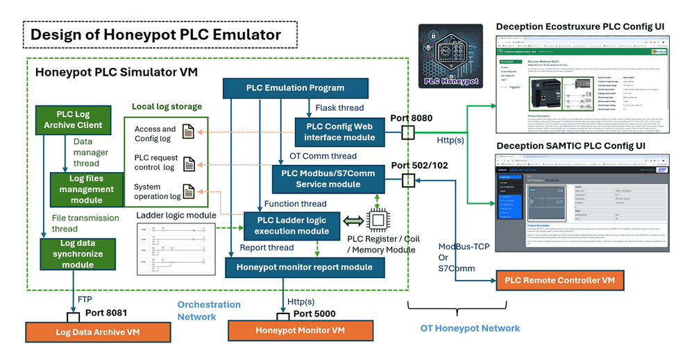
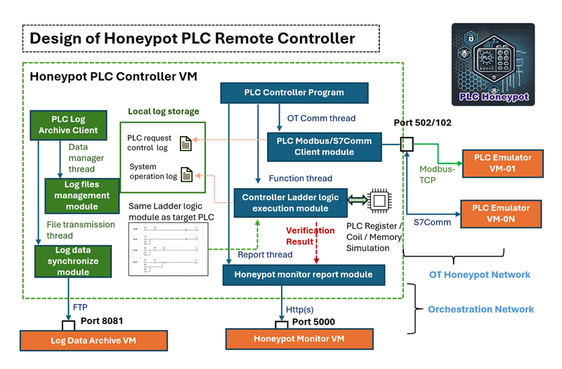
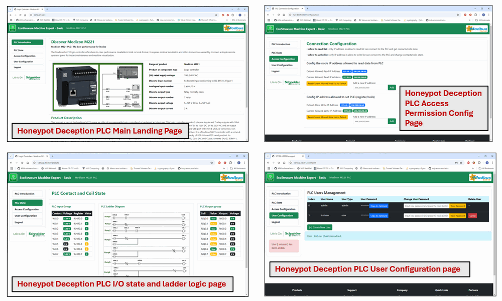
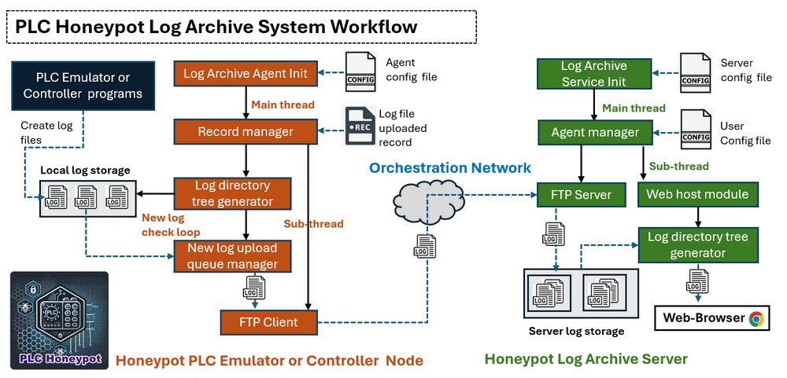

# Python PLC Honeypot Project


**Program Design Propose** : This project aims to develop a sophisticated honeypot system that emulates an OT (Operational Technology) SCADA network environment, bridging Level 1 OT field controller devices (PLCs) with Level 2 control programs, including Human-Machine Interfaces (HMIs). This honeypot will simulate various PLC models from major vendors, such as Schneider and Siemens, while supporting the primary communication protocols `Modbus-TCP` and `Siemens-S7Comm`. The system will integrate essential components: PLC emulator, OT controller simulator, ladder logic verifier, data logger, attack detector and system monitor. 

As a cybersecurity honeypot, the system will detect unauthorized access attempts on PLCs, including attempts to log in to PLC configuration pages via HTTP/HTTPS, send the OT control request, and fetch PLC state data. The orchestrator will monitor for possible attack scenario such as Denial of Service (DoS),  False Command Injection (FCI) and False Data Injection (FDI) attacks. The system will log and display real-time data on system execution states, enabling blue teams defenders to monitor and analyze attacker or red team behaviors. Designed for cybersecurity training, cyber defense exercises, Capture the Flag (CTF) challenges, and hands-on attack/defense competitions, this PLC honeypot provides a realistic and interactive platform for advancing OT cybersecurity skills and strategies.

```
# Created:     2024/10/28
# Version:     v_0.1.3
# Copyright:   Copyright (c) 2024 LiuYuancheng
# License:     MIT License      
```

**Table of Contents**

[TOC]

------

### Introduction

The Python PLC Honeypot Project is a distributed cybersecurity solution designed to mimic the behavior of real SCADA network control flows between Programable Logic Controllers (PLCs) and Human-Machine Interfaces (HMIs), the honey pot is a full digital equivalent VMs based system without any special OT-hardware (user can also integrate the hardware in the system). This system lures potential red team attackers into engaging with a simulated OT (Operational Technology) environment, enabling the collection of attack data, Digital Forensics and Incident Response (DFIR) datasets, and supporting the development of enhanced security measures. It also provides a platform for blue team defenders to monitor, analyze, and respond to cyber threats in industrial environments. The system structure and workflow diagram is shown below:


`Figure-01: Py PLC honeypot system structure and workflow diagram, version v_0.1.3 (2024)`

The system is divided into three main subsystems:

- **PLC Emulators Subsystem**: The subsystem includes multiple `PLC_Emulation_VM`(s) to simulate Schneider Modicon M22X (Modbus-TCP) and Siemens S712xx (S7Comm) PLCs, capable of handling OT control requests and executing ladder logic to replicate realistic PLC behaviors. 
- **PLC Controllers Subsystem**: The subsystem includes multiple `PLC_Contoller_VM`(s) to mimics various control workflows (1-to-1, 1-to-N, and N-to-N HMI-PLC interactions) in OT environments, validating control interactions and reporting verification states to the monitoring system.
- **Honeypot Monitor Subsystem**: The subsystem includes one `Monitor_Hub_VM` and one `Log_Archive_Database_VM` to aggregate and process reports from PLC emulators, controllers, and network logs. It provides visualization, alerts, and notifications to defenders via different web based interactive dashboard.

#### System Network Introduction

The system operates across two isolated networks:


`Figure-02: Py PLC honeypot system network view diagram, version v_0.1.3 (2024)`

- **OT Honeypot Network**: Open to red team attackers for penetration testing, scanning, and OT protocol-based attacks. This network includes OT protocol communication between PLC emulators and controller simulators and provides access to PLC configuration interfaces via HTTP/HTTPS.
- **Orchestration Network**: Restricted to blue team defenders, this network centralizes monitoring, reporting, and log data archival. It also facilitates data flow between system components and the monitoring hub.

#### System Key Features Introduction

The PLC honey port System include below eight main features:

- **[1] PLC Emulation** : Provides realistic OT protocol simulations, ladder logic execution, and vendor-like PLC configuration interfaces. Emulates control logic to respond to OT requests, commands, simulating I/O operations and process control behaviors.
- **[2] Customizable OT Network** : Supports flexible and customizable configurations for building simple  (1 controller to 1 PLC ) or complex (N controllers to N PLCs) OT network structures, enabling the honeypot to act as a realistic, discoverable system with intentional vulnerabilities (e.g., open ports, weak authentication) to lure attackers
- **[3] Data Logging and Monitoring** : Records all actions, including attacker commands, config changes, control requests, system responses, and unauthorized access attempts. Log files from PLC emulators and controllers are synchronized to the log archive server for real-time tracking and historical analysis.
- **[4] Attack and Forensics Analysis**: Each components in the honeypot will collect the forensic data and report regularly, such as packet traces, login attempts, command logs, and abnormal behavior, for detailed post-incident analysis.
- **[5] Deception Layer for Attacker** : The controller will simulates realistic OT control systems by generating periodic and random PLC control requests. The emulator also provides highly convincing fake PLC configuration interfaces (90% similar) that mimic real vendor designs to deceive attackers into believing they are interacting with actual devices.
- **[6] Alerting and Notification System**: Each components will generate warnings and alerts for abnormal interactions, such as port scans, unauthorized logins, or configuration changes, then report the monitor hub. The monitoring hub consolidates reports to provide system-wide alerts for defenders.
- **[7] Integration with Security Infrastructure**: The system offers HTTP APIs to facilitate integration with Security Information and Event Management (SIEM) systems for centralized logging, alerting, and analysis.
- **[8] Management Console**: Provides different dashboards for real-time data visualization, system alerts, and performance analysis. Users can configure, monitor, and control various aspects of the honeypot through an intuitive interface.

This project provides a robust platform for cybersecurity training, testing, and research, contributing to improved resilience in industrial control systems. It has been used in two international CTF competition in Singapore and Europe. 


------

### Design of PLC Emulator

The PLC Emulator is designed to run on a virtual machine (VM) or a physical machine within the honeypot environment. It comprises two primary components:

- **PLC Emulation Program**: Simulates OT protocol behavior, executes ladder logic, and provides vendor-like PLC configuration interfaces. It emulates control logic to process OT requests and commands while simulating I/O operations and process control behaviors.
- **Log Archive Agent**: Manages the synchronization of emulator log files to a central log archive server using FTP, ensuring comprehensive and centralized log management for monitoring and analysis.

The program workflow diagram is shown below:



`Figure-03: Py PLC honeypot PLC Emulator Workflow diagram, version v_0.1.3 (2024)`

The PLC Emulation Program is the core component and operates with four parallel threads to ensure modularity and real-time operation:

**Flask Web Host Thread [PLC Config Web Interface Module] ** :

- Hosts a deceptive web interface mimicking a real vender's PLC configuration interface.
- Tracks and logs all attackers' interactions, request, scanning and unauthorized access attempts.

**Modbus and S7Comm Thread [PLC Modbus/S7comm Service Module] ** :

- Starts a Modbus-TCP server or S7Comm server to handle incoming OT control requests.
- Simulates vendor-specific protocol behaviors and the control rules (such as the data package and change limitation) to lure attackers.

**PLC Function Thread [PLC Ladder Logic Execution Module]** :

- Manages internal registers, coils, and memory changes based on controller's input and ladder logic execution.
- Executes imported ladder logic to simulate PLC I/O operations and process control tasks realistically.

**Monitor Report Thread [Honeypot Monitor Report Module]** : 

- Periodically reports the PLC's execution state, including any detected abnormal situations (e.g., warnings or alerts), to the honeypot monitor hub.

- Ensures real-time situational awareness for defenders.

The PLC Emulation Program generates three types of logs:

| Log File                             | Log Generated Module             | Log Contents                                                 |
| ------------------------------------ | -------------------------------- | ------------------------------------------------------------ |
| Access and Configuration Change Logs | PLC Config Web Interface Module  | Records unauthorized access attempts and configuration modifications. |
| OT Control Logs                      | PLC Modbus/S7comm Service Module | Tracks incoming OT protocol requests and their responses.    |
| System Logs                          | Emulator Main program            | Documents internal operations and exceptions.                |

The **Log Archive Agent** is responsible for managing and synchronizing log files generated by the PLC Emulator. It consists of two parallel threads:

**Log File Management Thread** :

- Categorizes, filters, and manages log files stored locally.
- Monitors for new, modified, or archived files in the local storage and ensures efficient log organization.

**Log Synchronization Thread**:

- Acts as an FTP client with a file synchronization queue.
- Automatically uploads newly created or updated log files to the central log archive server in the honeypot's orchestration network.

The multi-threaded design provides modularity, enabling simultaneous emulation of PLC processes, protocol handling, logging, and reporting. This architecture ensures both realism for attackers and comprehensive data collection for defenders.


------

### Design of PLC Controller

The PLC Controller is a critical component that connects to the PLC Emulator via OT protocol client threads. It simulates complex HMI-PLC control flows and enables the creation of realistic SCADA system control scenarios and provide the  verification function of PLC behavior to detect unauthorized command injections or other attacks. . The overall controller workflow is depicted in the following diagram:




`Figure-04: Py PLC honeypot PLC Controller Workflow Diagram, version v_0.1.3 (2024)`

The PLC Controller Program is designed to run **three parallel threads** for efficient and modular operation:

**OT Communication Thread [PLC Modbus/S7Comm Client Module]** :

- Handles OT communication with the target PLC(s).
- Sends control requests and retrieves feedback states using protocols like Modbus-TCP or S7Comm.

**Function Thread [Controller Ladder Logic Execution Module]** :

- Generates simulated deceptive control request data (e.g., register and coil changes).
- Verifies PLC execution results by comparing calculated and retrieved outputs.

**Monitor Report Thread [Honeypot Monitor Report Module]** :

- Regularly reports the controller’s execution state to the honeypot monitor hub.
- Logs abnormal situations, including warnings and alerts, for real-time analysis.

Similar to the PLC Emulator, each controller VM includes a **Log Archive Agent** to manage and synchronize logs with the central log archive server. 

To deploy the PLC controllers and emulates in honeypot network, users can run multiple PLC controller programs within a single VM or multiple VM, each capable of loading different ladder logic modules. This setup allows for simulation of **1-to-1**, **1-to-N**, **N-to-N**, or **Mixed** SCADA control workflows. The connection diagram is shown below:


`Figure-05: Honeypot PLC controller and emulator connection topology diagram, version v_0.1.3 (2024)`

Upon initialization, the PLC Controller performs the following steps:

**Step 1: Load Configuration**:

- Loads the exact same register states, coil states, memory configurations, and ladder logic module as its target PLC Emulator.

**Step 2: Simulate Control Cycles**:

- Generates randomized changes to PLC registers, coils, or memory settings, `request_0`.
- Executes the ladder logic internally to calculate the expected result, `result_0`.
- Sends the generated data `request_0` to the PLC Emulator for processing.
- Retrieves the PLC Emulator's execution result, `result_1`.

**Step 3: Verification Process**:

- Compares the internally calculated result `result_0` with the emulator’s result `result_1` to detect discrepancies.
- Reports **normal operation** if the results match or a **warning** to the honeypot monitor if a mismatch is detected.
- Triggers an **alert** to indicate a potential attack if mismatches are detected three consecutive times.

The following **verification workflow** illustrates the detection of a false command injection attack:

```mermaid
sequenceDiagram
participant Honeyport_Monitor
participant PLC_Controller
participant PLC_Emulator
participant RedTeam_Attacker

PLC_Controller-->PLC_Controller:Load Ladder Logic-01
PLC_Emulator-->PLC_Emulator:Load Ladder Logic-01
PLC_Controller-->PLC_Controller:Generate PLC register value
PLC_Controller->>PLC_Emulator:Send register change request
PLC_Controller-->PLC_Controller:Run Ladder Logic-01 to get expected result (r0)
PLC_Emulator-->PLC_Emulator:Run Ladder Logic-01 and update coil state
RedTeam_Attacker->>PLC_Emulator:Send malicious coil change command
PLC_Emulator->>PLC_Controller:Send coil state back to controller
PLC_Controller-->PLC_Controller:Verify expected result (r0) vs PLC feedback (r1) → Mismatch detected
PLC_Controller->>Honeyport_Monitor:Report potential attack
```

`Figure-06: Honeypot PLC controller and emulator operation verification work flow, version v_0.1.3 (2024)`

Its modular multi-threaded design allows for efficient execution of control logic, monitoring, and logging, making it a robust tool for honeypot environments. By accurately replicating complex SCADA workflows, the PLC Controller provides an effective mechanism for studying attacker behavior and improving industrial cybersecurity defenses.


------

### Design of Deception Layer 

The **OT deception layer** is designed to mimic a real industrial environment, providing attackers with realistic targets while recording their activities. As introduced in the **PLC Emulator** and **Controller** designs, this layer includes key features like access limitations, data type verification, and IP-based white-listing for permissions. These mechanisms aim to replicate genuine industrial setups and mislead attackers into believing they have compromised real systems. The deception layer includes four key features:

**[1] Access Limitation and Data Type Verification**:

- Enforces access control and validates input data to simulate security mechanisms typical of industrial systems.
- Implements IP-based white-listing to emulate network-level permission restrictions, adding credibility to the deception.

**[2] Realistic Web Configuration Interfaces**:

- The PLC Emulator includes a web configuration interface designed to replicate the appearance and behavior of real-world PLC systems.
- Attackers performing IP and port scans will encounter these interfaces, which are designed to convince them they are interacting with actual PLCs.

**[3] Vendor-Specific Emulation**:

- Each emulated PLC interface is modeled after the configuration UI of real-world PLCs from different vendors.
- **M221 PLC Emulator**: Mimics the Schneider Electric EcoStruxure Machine Expert M22X PLC interface. As shown below:


- **S71200 PLC Emulator**: Mimics the Siemens SIMATIC S7-1200/S7-1500 Web Server interface. As shown below:


**[4] Realistic Functionality**:

- Deception interfaces provide: Real-time I/O state display. Register and coil state visualization. Ladder logic diagram display. Network and user configuration options and User manual download capabilities.
- These features are designed to mirror genuine PLC functionality and lure attackers deeper into interaction.

The M221 deception web user interface is shown below:



The S71200 PLC deception web user interface is shown below:


For the function of each deception PLC configuration web interface:  

- **Honeypot Deception PLC Main Landing Page** : Web page provides PLC module introduction, Vendor and basic PLC information (e.g., IP address, protocol type), Navigation to other tabs and PLC user manual download option. The page is accessible without login.

- **Honeypot Deception PLC I/O State and Ladder Logic Page** : Web page displays Real-time input/output connection pin voltages, Register and coil states, Ladder logic currently being executed by the PLC. The page is accessible to any logged-in users.

- **Honeypot Deception PLC Access Permission Config Page** : Web page all Adding, removing, or resetting IP addresses in the PLC permission control list. The page is restricted to admin account users.

- **Honeypot Deception PLC User Configuration Page** : Web page Provides functionality to create, remove, or update users.

  configure user access permissions for the PLC. The page is restricted to admin account users.

**Monitoring and Attack Detection**

- **Activity Logging**: All actions performed by an attacker on the PLC configuration pages are logged and reported to the PLC Monitor Hub.
- **Attack Alerts**: If an attacker brute-forces the admin password and gains unauthorized access, the system immediately logs the activity and flags it as a potential attack and A high-priority alert will be sent to the PLC Monitor Hub.

By replicating real-world interfaces and functionality, this layer not only enhances the realism of the honeypot environment but also helps identify potential attack vectors. The combination of realistic deception interfaces, activity monitoring, and attack alerting ensures that attackers are misled while their actions are carefully observed.


------

### Design of Data Log System

The **Data Log System** ensures comprehensive monitoring and logging of all actions and progress within the PLC Emulators and Controllers. This system provides defenders with access to a centralized repository for analyzing log data and identifying potential security incidents. As shown in the Emulator and controller design, each VM will run a log archive agent to synchronize the log data to the log server. The log system includes 2 main parts: 

- **Log Archive Agent**: An agent program running on the PLC emulator or controller VM/Computer to regularly check the program and required system log data status and upload newly generated log files to the log archive server with the FTP client.
- **Log Archive Server:** A service program running on the log database server to maintain several file structure trees identical to those on the client nodes, save the log files, and provide a web interface for blue team defenders to search and view the logs.

The system workflow is shown below:



The following steps summarize the system workflow:

1. The **Log Archive Agent** collects log data from the **PLC Emulator** or **Controller**.
2. Logs are synchronized with the **Log Archive Server** via FTP.
3. The **Log Archive Server** organizes the logs into structured directories and makes them accessible via its web interface.
4. Blue Team defenders use the web interface to analyze logs or export them for use in other systems, such as SIEM or DFIR datasets.

Each log message includes the following fields: Timestamp, Log Type (normal action, info, warning, error, alert) and the detailed log data as shown in the below example:

```
2024-11-21 14:38:01,209 INFO     PLC controller Controller01 Inited
2024-11-21 14:38:01,209 INFO     PLC controller verification loop started
2024-11-21 14:38:01,210 INFO     Start one around verification.
2024-11-21 14:38:11,210 INFO     Random generate input: [False, False, False, True, True, True, True, False]
2024-11-21 14:38:11,211 INFO     Expected output: [False, True, False, True, False, True, True, True]
2024-11-21 14:38:13,034 INFO     Get PLC result: [False, True, False, True, False, True, True, True]
2024-11-21 14:38:13,034 INFO     Start one around verification.
2024-11-21 14:38:23,059 INFO     Random generate input: [False, True, True, False, True, False, True, True]
2024-11-21 14:38:23,059 INFO     Expected output: [False, False, False, True, False, True, False, False]
2024-11-21 14:38:24,883 INFO     Get PLC result: [False, False, False, True, False, True, False, False]
2024-11-21 14:38:24,884 INFO     Start one around verification.
```

The blue team defenders can use the Web interface to check, search and filter all the logs from the archive server's web UI as shown below:


In the main page, the blue team defender can check the total log size, agent connection state and select the emulator or controller's log based on the PLC emulator or controller ID. Then the page will switch to the component's log view page for user to filter, search and check the detailed log files contents. User can also do the further processing of the logs to integrated in their SIEM system or use the raw log file as the DFIR data set. 


------


Reference: 

https://cache.industry.siemens.com/dl/files/496/68011496/att_959527/v2/68011496_Examples_for_S7WebServer_DOC_v21_en.pdf

------


The PLC honey port System include below eight main features:

- **[1] PLC Emulation** : the PLC emulator will provide customization of real OT protocol simulation, PLC ladder logic execution, PLC configuration interface and PLC information (like model type, firmware version, and IP address) to imitate various real-world PLCs. It mimics the control logic processing to respond to commands realistically, including simulating I/O operations and process control behavior.
- **[2] Customizable OT network** : The system provide the flexible network communication configuration for green team or user to build simple (1 controller to 1 PLC ) or complex (N controllers to N PLCs) OT network structure. It allows the honeypot to be discovered on the network, acting like a real PLC-Controller system and Creates intentional vulnerabilities (e.g., open ports, weak authentication) to lure attackers.
- **[3] Data Logger and Monitor** : All the action such as commands sent by attackers, responses given by the honeypot, and any unauthorized access attempts. will be recorded by the each PLC and controller module in each VM's log files and synchronize to the Log archive server in the orchestration network which Enables real-time tracking of interactions, allowing administrators to observe and respond to incidents.
- **[4] Attack and Forensics Analysis** : Each components in the honeypot will report the forensic data such data access, packet traces, login and command logs, configuration changes and especially abnormal system behavior, for post-incident analysis.
- **[5] Deception Layer for Attacker** : The controller will continuous generate periodically and random PLC state fetching and control request to create the illusion of a real-world complex OT control system engage attackers, at the same time each PLC will also provide the "fake" configuration interface which user interface is 90% similar as the vender's real PLC configureUI to make the attackers believe they are connecting to the real physical device.
- **[6] Alerting and Notification System** : Each components will provide abnormal report function, if the component detected abnormal interaction with other port it will evaluate its own state and report to the monitor hub, such as if a port scan it touch to the system it will report a warning and if an authorization login or config change (change PLC allow read IP address) the PLC will report an alert. The monitor will evaluate the whole system state based all the components report then create the alert notification for the defense team.

- **[7] Integration with Security Infrastructure** : The system provide different http API to transfer the data or integrate or connect with other Security Information and Event Management (SIEM) systems for centralized logging, alerting, and analysis.
-  **[8] Management Console** : the honeypot monitor hub provides different dashboard interface to Displays real-time data and alerts, allowing security teams to manage and analyze the honeypot's performance. User can also use different API interface to check,  configure, and control various aspects of the honeypot.


------


We want to create a python PLC honey pot system with below features:

### 1. **PLC Emulator**

- **Protocol Emulation**: Simulates communication protocols (e.g., Modbus, S7Comm, DNP3, EtherNet/IP) to make the honeypot behave like a real PLC.
- **Control Logic Simulation**: Mimics control logic processing to respond to commands realistically, including simulating I/O operations and process control behavior.
- **Configurable Device Profile**: Allows customization of device settings like model type, firmware version, and IP address to imitate various real-world PLCs.

### 2. **Network Interface**

- **IP Configuration**: Allows the honeypot to be discovered on the network, acting like a real PLC.
- **Vulnerability Simulation**: 
- **Network Visibility**: Integrates with network infrastructure to monitor and capture traffic directed to the honeypot.

### 3. **Data Logger and Monitor**

- **Interaction Logging**: Records all communications, including commands sent by attackers, responses given by the honeypot, and any unauthorized access attempts.
- **Packet Capturing**: Captures network traffic for deeper analysis of attack methods.
- **Real-time Monitoring**: Enables real-time tracking of interactions, allowing administrators to observe and respond to incidents.

### 4. **Alerting and Notification System**

- **Automated Alerts**: Sends notifications to administrators when specific events or suspicious activities are detected (e.g., repeated login attempts, abnormal commands).
- **Event-Based Triggers**: Configurable to trigger alerts based on predefined rules, making it easier to detect ongoing attacks.

### 5. **Attack Analysis and Forensics Module**

- **Data Analysis Tools**: Analyzes captured data to identify patterns and techniques used by attackers.
- **Forensic Data Collection**: Gathers evidence, including packet traces, command logs, and system behavior, for post-incident analysis.
- **Reporting**: Generates detailed reports on detected activities, providing insights into potential vulnerabilities and attack vectors.

### 6. **Deception Layer**

- **Fake System Environment**: Simulates a larger network or industrial setup, creating the illusion of a more complex control system to engage attackers.
- **Bait Mechanisms**: Includes features like fake data, open services, and apparent vulnerabilities to make the system more appealing to attackers.

### 7. **Integration with Security Infrastructure**

- **SIEM Integration**: Connects with Security Information and Event Management (SIEM) systems for centralized logging, alerting, and analysis.
- **Threat Intelligence Feeds**: Shares information on detected threats with threat intelligence platforms, helping to build a broader defense strategy.

### 8. **Management Console**

- **Configuration Management**: Provides a user interface to set up, configure, and control various aspects of the honeypot.
- **Monitoring Dashboard**: Displays real-time data and alerts, allowing security teams to manage and analyze the honeypot's performance.
- **Remote Access**: Enables administrators to manage the system remotely, ensuring flexibility in monitoring and response.

These components work together to create a **comprehensive PLC honeypot system** that not only mimics real PLCs but also effectively captures attacker behaviors, gathers intelligence, and enhances the overall security posture of industrial environments.