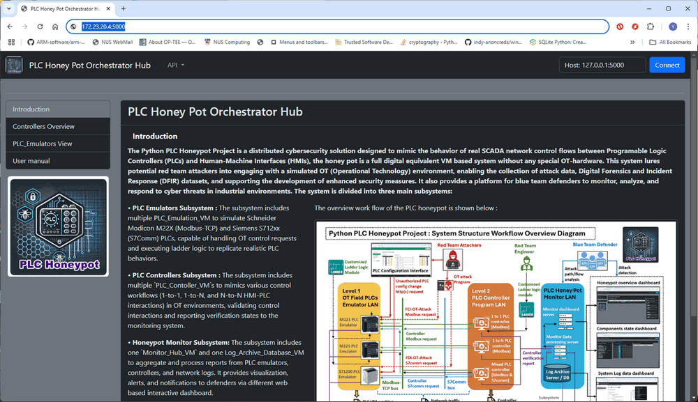
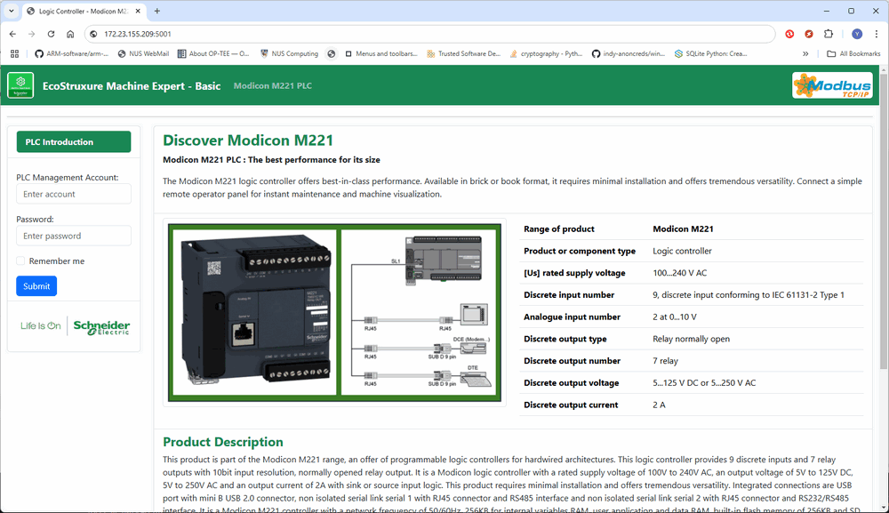
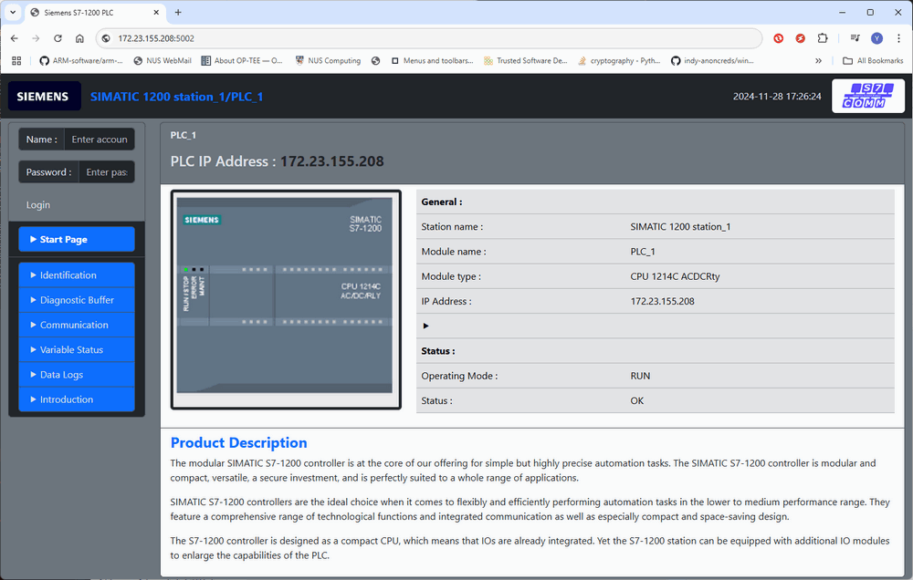
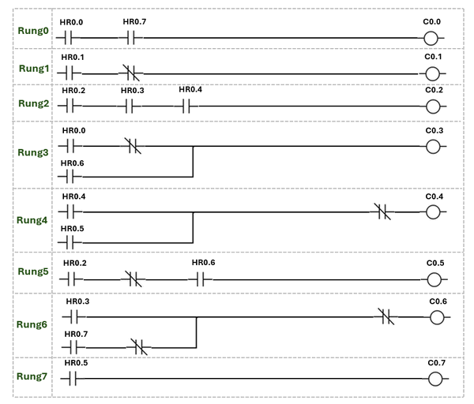

# Python PLC Honeypot User Manual


This manual will show the detailed step about how to deploy the honeypot system in your environment and use the honeypot for some possible attack detection. This document  will show an example of deploying a simple mixed OT protocol honey pot with two 1-to-1 emulator and controller pair  as green team engineers and use this honey pot to show how to detect the red team attacker's false data injection attack path as blue team defenders. 

**Table of Contents**

[TOC]

------

### Honeypot Deployment

To deploy the honeypot system, you need at least 6 VMs to build 2 isolated network with 2 network switches. For each PLC controller and emulator VM, they need 2 network interface to join in the **OT Honeypot Network** and the **Orchestration Network**. The network topology is shown below:


All the VMs OS we can use the Ubuntu22.04 and for the deploy sequence, please follow below table:

| VM Name                      | Deploy Sequence | Honeypot IP    | Orchestration IP | Program/Module Needed                             |
| ---------------------------- | --------------- | -------------- | ---------------- | ------------------------------------------------- |
| **Honeypot Monitor hub VM**  | 1               | N.A            | 172.23.20.4      | `lib` , `honeypotMonitor`                         |
| **Honeypot Log Archive VM**  | 2               | N.A            | 172.23.20.5      | `lib`, `honeypotLogServer`                        |
| **Modbus PLC emulator VM**   | 3               | 172.23.155.209 | 172.23.20.9      | `lib`, `modbusPlcEmulator`, `honeypotLogClient`   |
| **Modbus PLC Controller VM** | 4               | 172.23.155.206 | 172.23.20.6      | `lib`, `modbusPlcController`, `honeypotLogClient` |
| **S7comm PLC emulator VM**   | 5               | 172.23.155.208 | 172.23.20.8      | `lib`, `s7commPlcEmulator`, `honeypotLogClient`   |
| **S7comm PLC Controller VM** | 6               | 172.23.155.207 | 172.23.20.7      | `lib`, `s7commPlcController`, `honeypotLogClient` |

For the module needed, please refer to the module list in the Readme file's system setup `Program file list` section, for each VM please also follow the system setup to install the needed lib in the OS. 


#### Deploy Honeypot Monitor hub VM

**Step1 Setup Program**: Follow the program setup section to install the libs then create a folder `monitor/src` and copy `lib` , `honeypotMonitor` in it . 

**Step2 Change the config file** :  Rename the `src/honeypotMonitor/config_template.txt` to `src/honeypotMonitor/config.txt` 

**Step3 Run the program** : cd to the `honeypotMonitor`  folder and run the monitor hub program with cmd `sudo python3 monitorApp.py` , then in the  orchestration network open URL http://172.23.20.4:5000 to check whether the monitor hub online as shown below:




#### Deploy Honeypot Log Archive VM

**Step1 Setup Program**: Follow the program setup section to install the libs then create a folder `logServer/src` and copy `lib` , `honeypotLogServer`in it . 

**Step2 Change the config file** :  Rename the `src/honeypotLogServer/ServerConfig_template.txt` to `src/honeypotLogServer/ServerConfig.txt`  and argent user credential file`src/honeypotLogServer/userRecord_template.json`  to `src/honeypotLogServer/userRecord.json`

Add the agent's login pass word in the `userRecord.json` as shown below: 

```json
"agent": {
    "passwd": "123456",
    "perm": "elradfmwM"
}
```

In the config file `ServerConfig.txt` change the test mode to `False` :

```
...
line06: # Web test mode flag: True start without init the FTP server
line07: TEST_MODE:False
...
```

**Step3 Run the program** : cd to the `logServer` folder and run the monitor hub program with cmd `sudo python3 logArchiveServerApp.py` , the in the  orchestration network open URL http://172.23.20.5:5003 to check whether the monitor hub online as shown below:


#### Deploy Modbus PLC Emulator VM

**Step1 Setup Program**: Follow the program setup section to install the libs then create a folder `plcEmulator/src` and copy `lib` , `honeypotLogClient` `modbusPlcEmulator` in it . 

**Step2 Deploy the log archive client program** 

For the log archive agent program, rename the `src/honeypotLogClient/AgentConfig_template.txt` to `src/honeypotLogClient/AgentConfig.txt`  , add the PLC ID, IP address, log server IP, log folder name in the AgentConfig.txt as shown below : 

```
#-----------------------------------------------------------------------------
# Unique Agent ID, all the log file will be saved in the server's home/<AGENT_ID>/ folder
AGENT_ID:modbusPLC01
AGENT_IP:172.23.155.209
#-----------------------------------------------------------------------------
# FTP server info and login credentials, don't upload the credentials to the Github
FTP_SER_IP:172.23.20.5
FTP_SER_PORT:8081
USER_NAME:agent
USER_PWD:P@ssw0rd

...

#-----------------------------------------------------------------------------
# local folder save the log files. 
LOG_DIR:Logs
```

Run the log archive client program with cmd `python3 logArchiveAgent.py` then open the archive server's agent list page to check whether the log archive agent register and connect to the server


**Step3 Deploy the PLC Emulator Program** 

Rename the `src/modbusPlcEmulator/config_template.txt` to `src/modbusPlcEmulator/config.txt`,  add the PLC ID, IP address, controller IP in allow read and write list, monitor hub IP address and port as shown below

```
# This is the config file template for the PLC honeypot project's Modbus PLC 
# emulator program <modbusPlcApp.py>
# Setup the parameter with below format (every line follows <key>:<value> format, the
# key can not be changed):
#-----------------------------------------------------------------------------
# OwnID should not include space or other special characters.
Own_ID:modbusPLC01
Own_IP:172.23.155.209
# The OT protocol type string, "Modbus" or "S7Comm".
PRO_TYPE:Modbus
# The ladder logic file id used by this PLC emulator.
LADDER_ID:mbLadderLogic.py
#-----------------------------------------------------------------------------
# Define the ip addresses allowed to read PLC state: 
# json list format: ["masterIP", "slave1IP", ...]
ALLOW_R_L:["172.23.155.206"]
# Define the ip addresses allowed to change PLC state: 
# json list format: ["masterIP", "slave1IP", ...]
ALLOW_W_L:["172.23.155.206"]
#-----------------------------------------------------------------------------
# define the monitor hub parameters : 
MON_IP:172.23.20.4
MON_PORT:5000
# Time interval to report to the monitor hub in seconds:
RPT_INTERVAL:5
#-----------------------------------------------------------------------------
# Init the PLC local web Flask app parameters
FLASK_SER_PORT:5001
FLASK_DEBUG_MD:False
FLASK_MULTI_TH:True
# The PLC local web  use credential record file 
USERS_RCD:users.json
```

Rename the user credential file `src/modbusPlcEmulator/users_template.json` to  `src/modbusPlcEmulator/users.json`. 

Run the modbus PLC emulator program with cmd `sudo python3 modbusPlcApp.py` , then in the honey pot network open URL http://172.23.155.209:5001 to check whether the monitor hub online as shown below:



Then go to the monitor hub to check whether the PLC emulator has registered in the monitor hub through the orchestration network as shown below:


#### Deploy Modbus PLC Controller VM

**Step1 Setup Program**: Follow the program setup section to install the libs then create a folder `plcController/src` and copy `lib` , `honeypotLogClient`,  `modbusPlcController` in it . 

**Step2 Deploy the log archive client program** 

For the log archive agent program, rename the `src/honeypotLogClient/AgentConfig_template.txt` to `src/honeypotLogClient/AgentConfig.txt`  , add the PLC ID, IP address, log server IP, log folder name in the AgentConfig.txt as shown below : 

```
#-----------------------------------------------------------------------------
# Unique Agent ID, all the log file will be saved in the server's home/<AGENT_ID>/ folder
AGENT_ID:Controller01
AGENT_IP:172.23.155.206
#-----------------------------------------------------------------------------
# FTP server info and login credentials, don't upload the credentials to the Github
FTP_SER_IP:172.23.20.6
FTP_SER_PORT:8081
USER_NAME:agent
USER_PWD:P@ssw0rd
...
#-----------------------------------------------------------------------------
# local folder save the log files. 
LOG_DIR:Logs
```

Run the log archive client program with cmd `python3 logArchiveAgent.py` then open the archive server's agent list page to check whether the log archive agent register and connect to the server


**Step3 Deploy the PLC Controller Program** 

Rename the `src/modbusPlcController/config_template.txt` to `src/modbusPlcController/config.txt`,  add the PLC ID, IP address, controller IP in allow read and write list, monitor hub IP address and port as shown below

```
# This is the config file template for the  the PLC honeypot project's Modbus PLC 
# controller program <mbPlcControllerApp.py>
# Setup the parameter with below format (every line follows <key>:<val> format, the
# key can not be changed):

#-----------------------------------------------------------------------------
OWN_ID:Controller01
OWN_IP:172.23.155.206

# The OT protocol type string, "Modbus" or "S7Comm".
PRO_TYPE:Modbus

# The ladder logic file id used by this PLC controller.
LADDER_ID:mbLadderLogic.py

#-----------------------------------------------------------------------------
# The PLC ID and IP address, the ID must be same as the 
PLC_ID:modbusPLC01
PLC_IP:172.23.155.209
PLC_PORT:502

# PLC data fetch time interval (sec)
PLC_CINT:10

#-----------------------------------------------------------------------------
# define the monitor hub parameters : 
MON_IP:172.23.20.4
MON_PORT:5000

# Time interval to report to the monitor hub in seconds:
RPT_INTERVAL:5
```

Then go to the monitor hub to check whether the PLC controller has registered in the monitor hub through the orchestration network as shown below:


#### Deploy S7Comm PLC Emulator VM

**Step1 Setup Program**: Follow the program setup section to install the libs then create a folder `plcEmulator/src` and copy `lib` , `honeypotLogClient` `s7commPlcEmulator` in it . 

**Step2 Deploy the log archive client program** 

For the log archive agent program, rename the `src/honeypotLogClient/AgentConfig_template.txt` to `src/honeypotLogClient/AgentConfig.txt`  , add the PLC ID, IP address, log server IP, log folder name in the AgentConfig.txt as shown below : 

```
#-----------------------------------------------------------------------------
# Unique Agent ID, all the log file will be saved in the server's home/<AGENT_ID>/ folder
AGENT_ID:S7commPLC02
AGENT_IP:172.23.155.208
#-----------------------------------------------------------------------------
# FTP server info and login credentials, don't upload the credentials to the Github
FTP_SER_IP:172.23.20.6
FTP_SER_PORT:8081
USER_NAME:agent
USER_PWD:P@ssw0rd
...
#-----------------------------------------------------------------------------
# local folder save the log files. 
LOG_DIR:Logs
```

Run the log archive client program with cmd `python3 logArchiveAgent.py` then open the archive server's agent list page to check whether the log archive agent register and connect to the server same as Modbus PLC Emulator VM config section.

**Step3 Deploy the PLC Emulator Program** 

Rename the `src/s7CommPlcEmulator/config_template.txt` to `src/s7CommPlcEmulator/config.txt`,  add the PLC ID, IP address, controller IP in allow read and write list, monitor hub IP address and port as shown below

```
# This is the config file template for the PLC honeypot project's S7Comm PLC 
# emulator program <S7CommPlcApp.py>
# Setup the parameter with below format (every line follows <key>:<value> format, the
# key can not be changed):

#-----------------------------------------------------------------------------
# OwnID should not include space or other special characters.
Own_ID:S7commPLC02
Own_IP:172.23.155.208

# The OT protocol type string, "Modbus" or "S7Comm".
PRO_TYPE:S7Comm

# The ladder logic file id used by this PLC emulator.
LADDER_ID:s7LadderLogic.py

#-----------------------------------------------------------------------------
# define the monitor hub parameters : 
MON_IP:172.23.20.4
MON_PORT:5000

# Time interval to report to the monitor hub in seconds:
RPT_INTERVAL:5

#-----------------------------------------------------------------------------
# Init the PLC local web Flask app parameters
FLASK_SER_PORT:5002
FLASK_DEBUG_MD:False
FLASK_MULTI_TH:True

# The PLC local web  use credential record file 
USERS_RCD:users.json
```

Rename the user credential file `src/s7commPlcEmulator/users_template.json` to  `src/s7commPlcEmulator/users.json`. 

Run the S7Comm PLC emulator program with cmd `sudo python3 s7commPlcApp.py` , then in the honey pot network open URL http://172.23.155.208:5001 to check whether the monitor hub online as shown below:



Then go to the monitor hub to check whether the PLC emulator has registered in the monitor hub through the orchestration network same as the step deploying the Modbus PLC Emulator VM. 


#### Deploy S7Comm PLC Controller VM

**Step1 Setup Program**: Follow the program setup section to install the libs then create a folder `plcController/src` and copy `lib` , `honeypotLogClient`,  `s7commPlcController` in it . 

**Step2 Deploy the log archive client program** 

For the log archive agent program, rename the `src/honeypotLogClient/AgentConfig_template.txt` to `src/honeypotLogClient/AgentConfig.txt`  , add the PLC ID, IP address, log server IP, log folder name in the AgentConfig.txt as shown below : 

```
#-----------------------------------------------------------------------------
# Unique Agent ID, all the log file will be saved in the server's home/<AGENT_ID>/ folder
AGENT_ID:Controller02
AGENT_IP:172.23.155.206
#-----------------------------------------------------------------------------
# FTP server info and login credentials, don't upload the credentials to the Github
FTP_SER_IP:172.23.20.6
FTP_SER_PORT:8081
USER_NAME:agent
USER_PWD:P@ssw0rd
...
#-----------------------------------------------------------------------------
# local folder save the log files. 
LOG_DIR:Logs
```

Run the log archive client program with cmd `python3 logArchiveAgent.py` then open the archive server's agent list page to check whether the log archive agent register and connect to the server same as Modbus PLC Controller VM config section.

**Step3 Deploy the PLC Controller Program** 

Rename the `src/s7CommPlcController/config_template.txt` to `src/s7CommPlcController/config.txt`,  add the PLC ID, IP address, controller IP in allow read and write list, monitor hub IP address and port as shown below

```
# This is the config file template for the  the PLC honeypot project's Modbus PLC 
# controller program <mbPlcControllerApp.py>
# Setup the parameter with below format (every line follows <key>:<val> format, the
# key can not be changed):

#-----------------------------------------------------------------------------
OWN_ID:Controller02
OWN_IP:172.23.155.206

# The OT protocol type string, "Modbus" or "S7Comm".
PRO_TYPE:S7Comm

# The ladder logic file id used by this PLC controller.
LADDER_ID:s7LadderLogic.py

#-----------------------------------------------------------------------------
# The PLC ID and IP address, the ID must be same as the 
PLC_ID:S7commPLC02
PLC_IP:172.23.155.208
PLC_PORT:102

# PLC data fetch time interval (sec)
PLC_CINT:10

#-----------------------------------------------------------------------------
# define the monitor hub parameters : 
MON_IP:172.23.20.4
MON_PORT:5000

# Time interval to report to the monitor hub in seconds:
RPT_INTERVAL:5
```

Then go to the monitor hub to check whether the PLC controller has registered in the monitor hub through the orchestration network same as the S7Comm PLC Emulator VM. 


#### Deploy Ladder Logic In Emulator and Controller

Both emulator and controller pair need to load the same ladder logic module, you can use the file `src\s7commPlcEmulator\s7LadderLogic.py` or file 

`src\modbusPlcEmulator\mbLadderLogic.py` as example to build the ladder logic.  As we use python program to simulate the ladder logic , this is an example we simulate the below ladder logic with 8 rung to get 8 input holding registers' value and change 8 coils:

Ladder logic diagram:



To simulate this logic, in the ladder logic module set the `runladderlogic()` function as shown in below example:

```
    #-----------------------------------------------------------------------------
    def runLadderLogic(self, regsList, coilList=None):
        """ Execute the ladder logic with the input holding register list and set 
            the output coils. In this example, there will be 8 rungs to be executed.
        """
        # coils will be set ast the reverse state of the input registers' state. 
        if len(regsList) != 8: return None
        # rung 0: HR0 and HR2 -> Q0
        c0 = regsList[0] and regsList[7]
        # rung 1: not HR1 -> Q1
        c1 = not regsList[1]
        # rung 2: HR2 and HR3 and HR4 -> Q2
        c2 = regsList[2] and regsList[3] and regsList[4]
        # rung 3: not HR0 or HR6 -> Q3
        c3 = (not regsList[0]) or regsList[6]
        # rung 4: not (HR4 or HR5) -> Q4
        c4 = not (regsList[4] or regsList[5])
        # rung 5: (not HR0) and HR6 -> Q5
        c5 = (not regsList[0]) and regsList[6]
        # rung 6: HR3 or (not HR7) -> Q6
        c6 = regsList[3] or (not regsList[7])
        # rung 7: HR5 -> Q7
        c7 = regsList[5]
        return [c0, c1, c2, c3, c4, c5, c6, c7]
```


------

